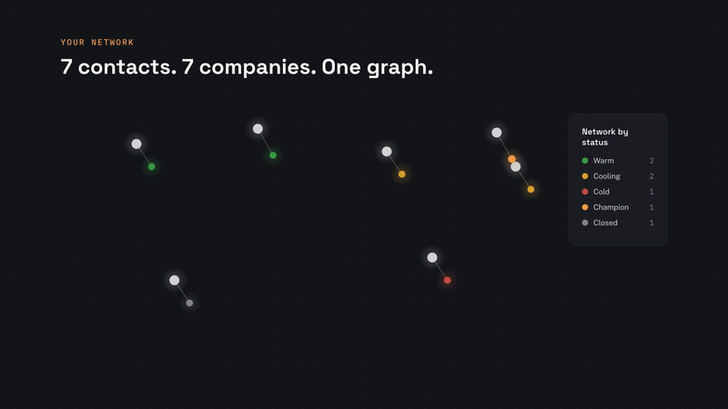
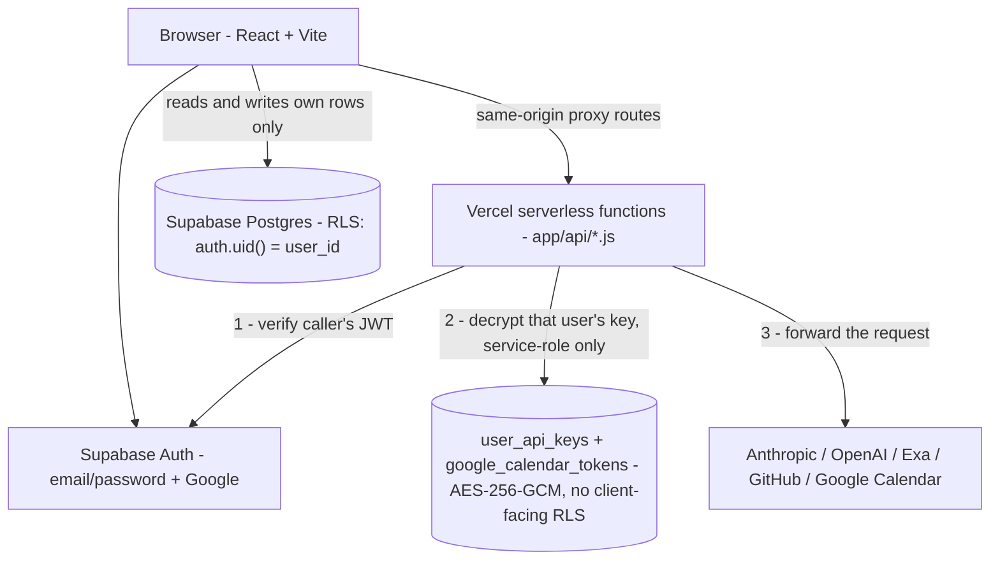

# Recruiting OS

A near zero-touch **recruiting operating system** for a student or early-career
job search — a lightweight CRM, application tracker, and job-board aggregator
with AI assistance, wrapped in a **React** dashboard.



▶ [Watch with sound](https://ethansaba.com/videos/recruiter.mp4) — built to read my own Gmail.

> **Multi-tenant, bring-your-own-key.** Sign up with email/password or Google,
> then add your own Anthropic/OpenAI/Exa/GitHub API keys in Settings. Your data
> (contacts, applications, interactions) lives in your own Supabase-backed
> account — nobody else can see it, and you're never billed for anyone else's
> AI usage (or vice versa). Try it without signing up at `/demo` (sample data,
> nothing saved).

---

## What it does

- **Contact CRM** — a contact list with status, urgency, follow-up dates, a
  "referred by" self-relation, table + card + force-directed graph views, and
  an interaction history ledger.
- **Application tracker** — one row per company/role with a stage funnel.
- **Networking tracker** — unified Call/LinkedIn/Meeting/Email/Other logging,
  a "Keep in Touch" reconnect-cadence queue, and referral coverage gaps against
  a target-company list.
- **Discover / Explore** — AI-ranked company + people discovery for target
  companies, sourced from Exa's public-web search (never scrapes or logs into
  LinkedIn).
- **Job-board aggregator** — track multiple GitHub internship-list repos,
  auto-import + dedup listings, bucket them (Needs Review / Applying / Maybe /
  Applied / Pass), get per-job AI fit analysis, and real deadline extraction
  from the actual apply page.
- **AI email pipeline** — a Google Apps Script watches a Gmail label, uses
  Claude/GPT to classify + extract each recruiting email, upserts the contact
  and application, and creates a Calendar event when an interview is scheduled.
- **"+ Event" / "+ Schedule"** — screenshot or text → Google Calendar event via
  Claude vision extraction, plus a lightweight scheduling-intent tracker.
- **AI provider switch** — every text-only AI call site runs through one
  provider-agnostic switch (`lib/ai.js`); flip between Claude and OpenAI with a
  single env var, no code changes.

---

## Architecture

The browser never holds an API key. Every third-party call is proxied through a serverless
function that verifies the caller's JWT, then decrypts *that user's* key server-side.



**Nobody's API key or data is ever visible to another user.** Row Level
Security policies scope every table read/write to `auth.uid() = user_id`;
`user_api_keys` and `google_calendar_tokens` have *no* client-facing RLS
policies at all — only server code holding the service-role key can decrypt
them, and only after verifying the caller's JWT names that same user.

---

## Tech stack

| Layer | Tech |
|---|---|
| Dashboard | React 18 + Vite, Tailwind v4 |
| Auth + data | Supabase (Postgres + Auth), Row Level Security |
| Data tables / graph | `@tanstack/react-table`, `react-force-graph-2d` |
| Charts | Recharts |
| Hosting | Vercel (serverless functions for auth + key injection) |
| AI | Claude (Anthropic) and/or OpenAI GPT — one switch, BYOK per user |
| Search | Exa (people/company discovery, deadline extraction) |
| Email automation | Google Apps Script |
| Calendar | Google Calendar API, per-user OAuth |

---

## Repo structure

```
app/                        React + Vite dashboard (primary interface)
  src/
    App.jsx                 Root App() — routes to /demo or the authed app
    db.js                    Supabase Postgres data layer (+ demo-mode in-memory branch)
    demoData.js              Seed data for the public /demo route
    lib/
      supabaseClient.js       Client-side Supabase client + authHeader()
      AuthContext.jsx          React context for auth state
      ai.js                    Provider-agnostic AI switch (Claude/OpenAI)
      scopedStorage.js         localStorage namespaced by user id
    components/
      LoginPage.jsx            Sign in / sign up (email + Google)
      SettingsTab.jsx          BYOK keys, profile, Google Calendar connect
  api/                       Vercel serverless functions (auth + key injection)
    _lib/                     supabaseAdmin.js, crypto.js, keys.js (shared server helpers)
    keys.js                   BYOK key CRUD (encrypted, server-only)
    google-connect.js         Per-user Google Calendar OAuth token capture
    claude-api.js / openai.js / exa.js / gh-api.js / google-calendar.js
  vite.config.js             Dev server — runs the real api/*.js handlers directly
scripts/
  email-pipeline.js          Google Apps Script — Gmail → Claude/GPT → Supabase
  migrate-notion-to-supabase.js   One-time: pull an existing Notion workspace into Supabase
supabase/
  migrations/                 SQL schema + RLS policies
notion/                      Legacy — schema reference + setup scripts for the
                             original single-tenant Notion version, kept only
                             for the one-time migration path above.
```

See [`CLAUDE.md`](CLAUDE.md) for a full technical overview.

---

## Setup

### 1. Supabase
Local dev (recommended to start):
```bash
supabase start   # from the repo root — prints your local API URL + anon/service_role keys
```
Or create a free project at <https://supabase.com> for production.

Apply the schema:
```bash
supabase db push   # against whichever project supabase link points at
```

### 2. Environment
```bash
cp .env.example .env
```
Fill in `VITE_SUPABASE_URL` / `VITE_SUPABASE_ANON_KEY` / `SUPABASE_URL` /
`SUPABASE_SERVICE_ROLE_KEY` from step 1's output, and generate a
`SECRET_ENCRYPTION_KEY` (command is in the `.env.example` comment). Google
Calendar's `GOOGLE_CLIENT_ID`/`GOOGLE_CLIENT_SECRET` are optional (only needed
for the "+ Event"/"Connect Calendar" feature). Everything else (Anthropic,
OpenAI, Exa, GitHub) is BYOK — added per-user in the app's Settings tab, not
in `.env`.

### 3. Dashboard (`app/`)
```bash
cd app
npm install
npm run dev          # http://localhost:3001
```
Sign up, then add your API keys in **Settings**.

Deploy to Vercel with the project **root directory set to `app/`**, and add
the same env vars as encrypted production environment variables.

### 4. Migrating from an existing Notion setup (optional)
If you're moving off an earlier single-tenant version of this app that used
Notion as the data store:
```bash
node scripts/migrate-notion-to-supabase.js you@example.com   # sign up in the app first
```
Requires `NOTION_API_KEY` + the four `*_DB_ID` vars in `.env` (see
[`notion/schema.md`](notion/schema.md)). Safe to re-run — it replaces just
that user's rows each time.

### 5. Email pipeline (`scripts/email-pipeline.js`)
1. Create a project at <https://script.google.com>, paste in the file.
2. Add your Supabase service-role key + AI key under **Project Settings →
   Script Properties**, and the target user id to attach parsed emails to.
3. In Gmail, create a `recruiting` label (and a filter to apply it).
4. Run `setup()` once, then add a time-based trigger (every ~10 min) on
   `processRecruitingEmails`.

---

## Notable decisions

**Multi-tenant BYOK, so the app costs nothing to run.** A single-tenant version would have
been far simpler, but it would mean either eating everyone's AI bill or shipping my key to
the browser. Instead each user brings their own key, encrypted at rest with AES-256-GCM in
a table that has *no* client-facing RLS policy at all — the browser cannot read it under
any query. Only server code holding the service-role key can decrypt, and only after
verifying the caller's JWT names that same user.

**Security lives in Postgres, not in application code.** Every user-data table enforces
`auth.uid() = user_id` as an RLS policy. A bug in a React component can't leak another
user's contacts, because the database refuses the read regardless of what the client asks
for.

**One AI switch instead of two integrations.** Every text-only AI call site goes through
`lib/ai.js`, so moving between Claude and OpenAI is one env var rather than a refactor.
Provider outages and pricing changes stop being code changes.

**PostgREST silently caps responses at 1000 rows.** `fetchApplications` looked correct and
worked fine — until an account crossed a thousand records and simply stopped seeing the
rest, with no error anywhere. It now paginates explicitly. Silent truncation is the worst
class of bug: the happy path never tells you.

**Vercel's zero-config catch-all routes only match one path segment.** `api/notion/[...path].js`
404s on deeper paths, which cost real debugging time. The fix was flat handlers with the
sub-path passed as a query param via `vercel.json` rewrites.

**`/demo` shares no code path with the real app.** It runs on in-memory seed data with no
Supabase session and no backend calls, so a public demo route can't become an accidental
read of live data.

## Security & privacy

- **Row Level Security everywhere.** Every user-data table enforces
  `auth.uid() = user_id` in Postgres itself — not just in application code.
- **BYOK keys and Google refresh tokens are never exposed to the browser.**
  They're AES-256-GCM encrypted at rest, in tables with zero client-facing RLS
  policies; only server code holding the service-role key can decrypt them,
  and only after verifying the caller's own JWT.
- **No secrets in the repo.** All keys are read from environment variables
  (`.env`, gitignored). Copy `.env.example` and fill in your own.
- **`/demo` is fully isolated** — in-memory sample data only, no Supabase
  session, no real backend calls, resets on reload.

---

## License

[MIT](LICENSE)
